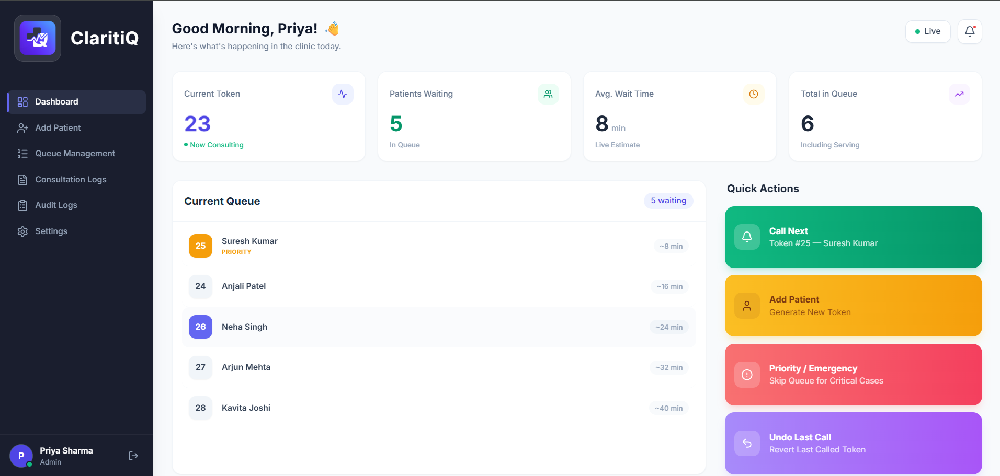
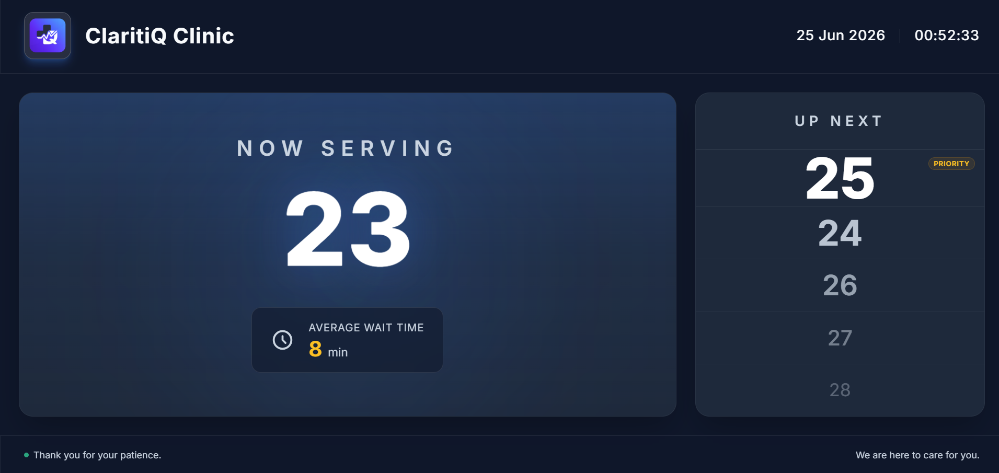
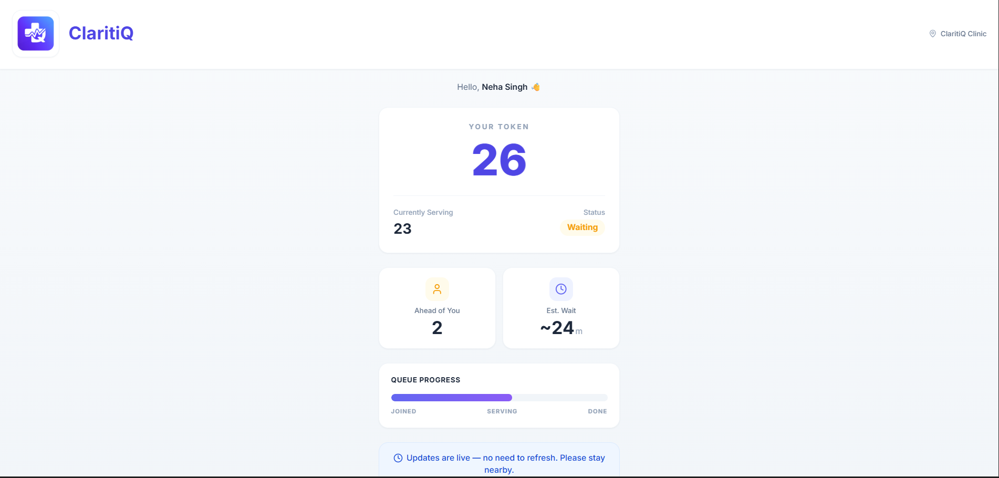

# ClaritiQ


## Why ClaritiQ?

The core problem in clinic waiting rooms is not waiting itself.

It is uncertainty.

Patients repeatedly ask:
"When will my turn come?"

ClaritiQ focuses on queue transparency rather than just token generation by providing live visibility, dynamic ETA prediction, and real-time synchronization across all interfaces.

### From Waiting to Knowing.

ClaritiQ is a real-time clinic queue visibility platform that replaces traditional paper token systems with a transparent digital experience.

Patients can track their position in the queue, view estimated wait times, and receive real-time updates, while receptionists gain a centralized dashboard to efficiently manage patient flow.

Built for **Queue Cure '26 Hackathon**.

---

## Problem Statement

Millions of clinics still rely on paper token slips and manual patient calling systems.

This leads to:

* Long waiting times
* No queue visibility
* Repeated patient inquiries
* Receptionist overload
* Poor patient experience

Patients often have no idea when they will be called and must continuously wait near the reception area.

ClaritiQ solves this problem through real-time queue transparency.

---

## Solution

ClaritiQ provides:

### Receptionist Dashboard

* Add Patients
* Generate Tokens
* Call Next Patient
* Undo Last Call
* Priority/Emergency Handling
* Queue Management
* Audit Logs

### Waiting Room Display

* Current Serving Token
* Upcoming Tokens
* Average Wait Time
* Queue Status Updates

### Patient Tracking

* QR-based access
* Live queue position
* Patients ahead
* Dynamic ETA
* Real-time updates

---

## Key Features

### Real-Time Synchronization

All connected screens update instantly using Socket.IO.

### Dynamic ETA Calculation

Wait times are calculated using consultation history rather than hardcoded values.

### Priority Queue Management

Supports:

* Critical Patients
* Priority Patients
* Normal Patients

### Emergency Handling

Priority cases automatically update queue ordering and notify waiting patients.

### QR-Based Patient Tracking

Patients can scan a QR code and track their queue status from any smartphone browser.

### Audit Logging

Tracks all major queue actions for accountability and debugging.

### Queue Recovery

Automatic reconnection and state synchronization after network interruptions.

---

## System Architecture

```text
Receptionist Dashboard
          |
          |
      Socket.IO
          |
          v

Node.js + Express Server
   Queue Management Engine
   ETA Calculation Engine
   Priority Queue Engine

          |
          v

MongoDB Atlas

          |
          +-------------------+
          |                   |
          v                   v

Waiting Room Display    Patient Tracking
```

---

## Tech Stack

### Frontend

* React
* TypeScript
* Tailwind CSS
* shadcn/ui
* Socket.IO Client

### Backend

* Node.js
* Express.js
* Socket.IO

### Database

* MongoDB Atlas

### Deployment

* Vercel
* Railway / Render

---

## Screenshots

### Receptionist Dashboard



---

### Waiting Room Display



---

### Patient Tracking Screen



---

## Queue Logic

Priority Order:

1. Critical
2. Priority
3. Normal

Queue operations are managed server-side to prevent race conditions and ensure consistency across connected clients.

---

## Real-Time Events

```text
PATIENT_CREATED
CALL_NEXT
UNDO_LAST_CALL
QUEUE_UPDATED
PATIENT_COMPLETED
PRIORITY_CHANGED
PATIENT_REMOVED
CLIENT_RECONNECTED
```

---

## Future Scope

* Doctor Dashboard
* WhatsApp Notifications
* SMS Alerts
* Multi-Doctor Clinics
* Appointment + Walk-in Hybrid Scheduling
* Multilingual Support
* AI-Based ETA Prediction
* ABDM Integration

---

## Installation

### Clone Repository

```bash
git clone https://github.com/AkhashJ28/ClaritiQ.git
```

### Frontend

```bash
cd frontend
npm install
npm run dev
```

### Backend

```bash
cd backend
npm install
npm run dev
```

## Application Routes

### Receptionist Dashboard
/
Main dashboard for queue management.

### Waiting Room Display
/display
Public display screen for clinic waiting areas.

### Patient Tracking
/track/:tokenId
Mobile-friendly patient queue tracking page.

## Demo Status

The MVP was completed during Queue Cure '26.

Deployment is currently in progress.

The complete source code and application architecture are available in this repository.

### Environment Variables

Create a `.env` file:

```env
MONGODB_URI=your_mongodb_connection_string
PORT=5000
CLIENT_URL=http://localhost:5173
```

---

### GitHub Repository

```text
https://github.com/AkhashJ28/ClaritiQ.git
```

---


## Team

Akhash J

Built during Queue Cure '26 Hackathon.


## Mission

Replace uncertainty with visibility.

Replace waiting with knowing.
